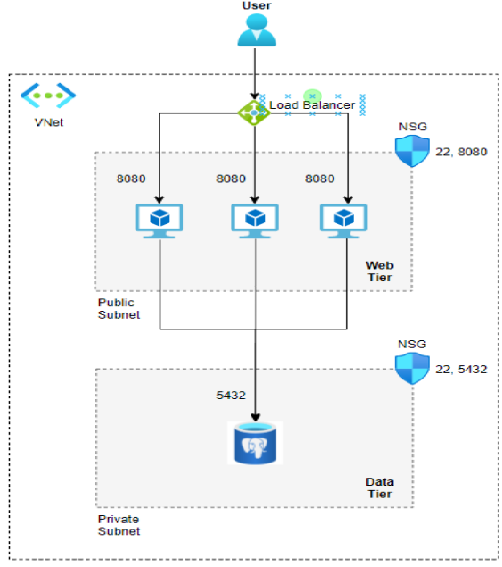

### Terraform Project


### Installation  
To install the infrastructure, run the following commands in your terminal:  
    
```
$ az login  #incase your using Azure cloud 

$ git clone https://github.com/yovelchen/Terraform.git
    
$ cd Terraform

$ cd infrastructure  
```
Then, 
```
$ terraform init

$ terraform plan  

$ terraform apply
```




